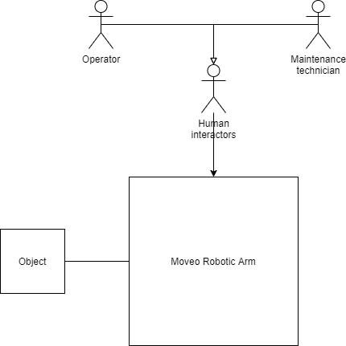

# **Specification**

The specification consists in describing the product with a "black box" external view to capture the intermediate technical objects (stakeholders, external interfaces, services, and constraints) that serve to, *in fine*, elucidate the product requirements. 

## **Stakeholders:**

*What entities influence the product throughout its life cycle ?*

- **Comments:**

  - A stakeholder is not necessarily a person (e.g. considering airports as a stakeholder when designing a two-deck aircraft).
  - A stakeholder can indirectly affect the product (e.g. considering neighborhood when designing a nuclear power plant).
  - A stakeholder can indirectly be affected by the product (e.g. considering the local biodiversity when designing an airport).

  ```
  **Metadata:**
  
  - Stakeholder name
  ```



<a href="../Sources/Draw_io/edit-diagram.html?repo=drawio-github&path=Stakeholders.png" target="_blank">Edit</a> | <a href="https://app.diagrams.net/#Uhttps%3A%2F%2Fraw.githubusercontent.com%2Fjgraph%2Fdrawio-github%2Fmaster%2Fdiagram.png" target="_blank">Edit As New</a> | <a href="https://app.diagrams.net/#Hjgraph%2Fdrawio-github%2Fmaster%2Fdiagram.png" target="_blank">Edit in diagrams.net</a>

## **External interfaces**

- **Definition:**  External interfaces are interactions between the product and the stakeholders.
- **Comments:**
  - An interface is made of a port (in, out, or in-out)
  - An interface is made of a flow (matter, energy, or signal)
- **Metadata**:
  - N/A

## **Service *(synonyms: external function, capability)* **

- **Definition:** A service is an effect intended by a stakeholder resulting from the interaction of the product with its environment (i.e. what the  product is for).
- **Comments:**
  - Services provides users with and exchange value that can be included in an economic system (e.g. airlines buy flight hours).
  - Services are intended effects that can observed from outside the product ("back box" external view), but not from outside an internal component ("white box" internal view).
  - Services are defined in a solution neutral way.
  - Services can be stated as follows : The [Product] shall enable [Stakeholder] [Action verb] (e.g. The product shall enable end-user to clean its teeths)
- **Metadata:**
  - Action verb (we often reason in terms of action verbs to communicate expected behaviours, so it would be nice to be able to search designs with action verbs)

## **Constraint *(Synonyms: non function requirement)* ** 

- Definition: A constraint is a choice that makes certain designs "not allowed" or inappropriate for its intended use.
- Example
- Metadata:

## **Requirement () :**

- **Definition:** A requirement is a formal statement that specifies when condition C is true, property P of object O is actual and its value shall belong  to domain D.
- **Comments:**